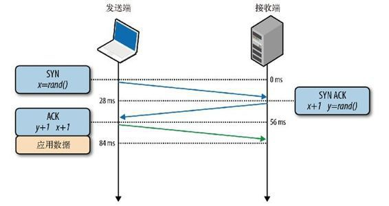
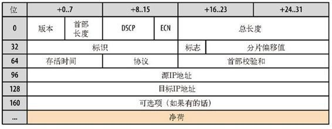
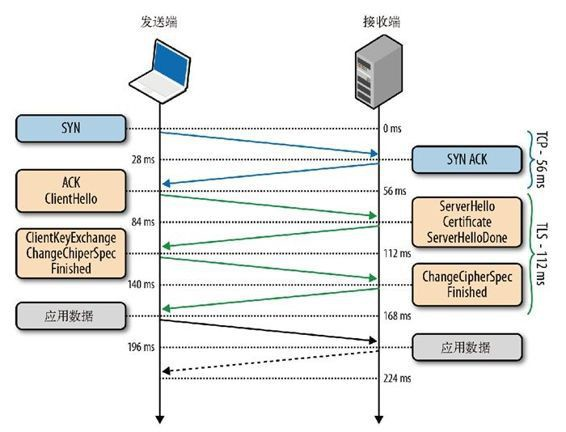

# 壹.5.2 了解TCP、UDP、TLS

了解一点底层网络通信原理，对日常工作有很大的帮助，减少与后端工程师的“日常沟通摩擦”，增强共鸣和互信与理解。而在面试过程中，很多公司会考察前端工程师的知识广度，TCP/IP、TCP、UDP、TLS是被高频问到的。

 TCP/IP协议是一个协议集，里面包括很多协议的，TCP、UDP、TLS等只是其中的协议。

TCP/IP协议集包括**应用层**，**传输层**，**网络层**，**网络访问层**。

 应用层包括：

* 超文本传输协议\(HTTP\)：万维网的基本协议；
* 文件传输\(TFTP简单文件传输协议\)；
* 远程登录\(Telnet\)，提供远程访问其它主机功能，它允许用户登录；
* internet主机，并在这台主机上执行命令；
* 网络管理\(SNMP简单网络管理协议\)，该协议提供了监控网络设备的方法，以及配置管理,统计信息收集，性能管理及安全管理等；
* 域名系统\(DNS\)，该系统用于在internet中将域名及其公共广播的网络节点转换成IP地址。

传输层包括：

* TLS，也即SSL\(Secure Sockets Layer，安全套接字层\)协议，后来IETF在标准化SSL协议时，将其改名为Transport Layer Security（TLS，传输层安全）。

 网络层包括：

* Internet协议\(IP\)
* Internet控制信息协议\(ICMP\) 
* 地址解析协议\(ARP\) 
* 反向地址解析协议\(RARP\)  ****

网络访问层：

* 网络访问层又称作主机到网络层\(host-to-network\)。网络访问层的功能包括IP地址与物理地址硬件的映射，以及将IP封装成帧。基于不同硬件类型的网络接口，网络访问层定义了和物理介质的连接。

## 壹.5.2.1 TCP

| 术语 | 含义 |
| :--- | :--- |
| SYN | 请求建立连接，并在其序列号的字段进行序列号的初始值设定。建立连接，设置为1。 |
| ACK | 确认号是否有效，一般置为1。 |
| FIN | 希望断开连接。 |
| URG | 紧急指针是否有效。为1，表示某一位需要被优先处理。 |
| PSH | 提示接收端应用程序立即从TCP缓冲区把数据读走。 |
| RST | 对方要求重新建立连接，复位。 |

### 三次握手

如上图，三次握手分别是：

1. **SYN** 客户端选择一个随机序列号x，并发送一个SYN数据包，其中可能还包括其他TCP标志和选项。 
2. **SYN ACK** 服务器给x加1，并选择自己的一个随机序列号y，追加自己的标志和选项，然后返回响应。 
3. **ACK** 客户端给x和y加1并发送握手期间的最后一个ACK数据包。 

### 握手对延迟的影响

三次握手完成后，客户端与服务器之间就可以通信了。客户端可以在发送ACK分组之后立即发送数据，而服务器必须等接收到ACK分组之后才能发送数据。这个启动通信的过程适用于所有TCP连接，因此对所有使用TCP的应用具有非常大的性能影响，因为每次传输应用数据之前，都必须经历一次完整的往返。

举个例子，如果客户端在纽约，服务器在伦敦，要通过光纤启动一次新的TCP连接，光握手至少就要花56 ms：向伦敦发送分组需要28 ms，响应发回纽约又要28 ms。在此，连接的带宽对时间没有影响，延迟完全取决于客户端和服务器之间的往返时间，这其中主要是纽约到伦敦之间的传输时间。 三次握手带来的延迟使得每创建一个新TCP连接都要付出很大代价。而这也决定了提高TCP应用性能的关键，在于想办法重用连接。

重用TCP连接有一个方案叫“TCP Fast Open”（TFO），Linux 3.7及之后的内核已经在客户端和服务器中支持TFO，具体内容可以查阅[IETF规范](https://tools.ietf.org/html/rfc7413)。

### 四次挥手


[跟着动画来学习TCP三次握手和四次挥手](https://juejin.im/post/6844903625513238541)


### 常见面试题 

#### 1.为什么连接的时候是三次握手，关闭的时候却是四次握手？

答：因为当Server端收到Client端的SYN连接请求报文后，可以直接发送SYN+ACK报文。其中ACK报文是用来应答的，SYN报文是用来同步的。但是关闭连接时，当Server端收到FIN报文时，很可能并不会立即关闭SOCKET，所以只能先回复一个ACK报文，告诉Client端，"你发的FIN报文我收到了"。只有等到我Server端所有的报文都发送完了，我才能发送FIN报文，因此不能一起发送。故需要四步握手。

#### 2.为什么TIME\_WAIT状态需要经过2MSL\(最大报文段生存时间\)才能返回到CLOSE状态？

答：虽然按道理，四个报文都发送完毕，我们可以直接进入CLOSE状态了，但是我们必须假象网络是不可靠的，有可以最后一个ACK丢失。所以TIME\_WAIT状态就是用来重发可能丢失的ACK报文。在Client发送出最后的ACK回复，但该ACK可能丢失。Server如果没有收到ACK，将不断重复发送FIN片段。所以Client不能立即关闭，它必须确认Server接收到了该ACK。Client会在发送出ACK之后进入到TIME\_WAIT状态。Client会设置一个计时器，等待2MSL的时间。如果在该时间内再次收到FIN，那么Client会重发ACK并再次等待2MSL。所谓的2MSL是两倍的MSL\(Maximum Segment Lifetime\)。MSL指一个片段在网络中最大的存活时间，2MSL就是一个发送和一个回复所需的最大时间。如果直到2MSL，Client都没有再次收到FIN，那么Client推断ACK已经被成功接收，则结束TCP连接。

#### 3.为什么不能用两次握手进行连接？

答：3次握手完成两个重要的功能，既要双方做好发送数据的准备工作\(双方都知道彼此已准备好\)，也要允许双方就初始序列号进行协商，这个序列号在握手过程中被发送和确认。现在把三次握手改成仅需要两次握手，死锁是可能发生的。作为例子，考虑计算机S和C之间的通信，假定C给S发送一个连接请求分组，S收到了这个分组，并发 送了确认应答分组。按照两次握手的协定，S认为连接已经成功地建立了，可以开始发送数据分组。可是，C在S的应答分组在传输中被丢失的情况下，将不知道S 是否已准备好，不知道S建立什么样的序列号，C甚至怀疑S是否收到自己的连接请求分组。在这种情况下，C认为连接还未建立成功，将忽略S发来的任何数据分 组，只等待连接确认应答分组。而S在发出的分组超时后，重复发送同样的分组。这样就形成了死锁。

#### 4.如果已经建立了连接，但是客户端突然出现故障了怎么办？

TCP还设有一个保活计时器，显然，客户端如果出现故障，服务器不能一直等下去，白白浪费资源。服务器每收到一次客户端的请求后都会重新复位这个计时器，时间通常是设置为2小时，若两小时还没有收到客户端的任何数据，服务器就会发送一个探测报文段，以后每隔75秒钟发送一次。若一连发送10个探测报文仍然没反应，服务器就认为客户端出了故障，接着就关闭连接。

## 壹.5.2.2 UDP

1980年8月，**UDP（User Datagram Protocol，用户数据报协议）**被John Postel加入了核心网络协议套件。UDP的主要功能和亮点并不在于它引入了什么特性，而在于它忽略的那些特性。UDP经常被称为无（Null）协议，RFC 768描述了其运作机制，全文完全可以写在一张餐巾纸上。

### 数据报

数据报（Datagram）为一个完整、独立的数据实体，携带着从源节点到目的地节点的足够信息，对这些节点间之前的数据交换和传输网络没有任何依赖。 数据报（datagram）和数据包（packet）是两个经常被人混用的词，实际上它们还是有区别的。数据包可以用来指代任何格式化的数据块，而数据报则通常只用来描述那些通过不可靠的服务传输的数据包，既不保证送达，也不发送失败通知。正因为如此，很多场合下人们都把UDP中User（用户）的U，改成Unreliable（不可靠）的U，于是UDP就成了“不可靠数据报协议”（Unreliable Datagram Protocol）。这也是为什么把UDP数据包称为数据报更为恰当的原因。

### UDP的“无协议”是怎么回事呢？

要理解为什么UDP被人称作“无协议”，必须从作为TCP和UDP下一层的IP协议说起。

IP层的主要任务就是按照地址从源主机向目标主机发送数据报（Datagram）。为此，消息会被封装在一个IP分组内（如下图），其中载明了源地址和目标地址，以及其他一些路由参数。

> 注意，数据报这个词暗示了一个重要的信息：IP层不保证消息可靠的交付，也不发送失败通知，实际上是把底层网络的不可靠性直接暴露给了上一层。

如果某个路由节点因为网络拥塞、负载过高或其他原因而删除了IP分组，那么在必要的情况下，IP的上一层协议要负责检测、恢复和重发数据。

而UDP协议会用自己的分组结构（如下图）封装用户消息，它只增加了4个字段：源端口、目标端口、分组长度和校验和。这样，当IP把分组送达目标主机时，该主机能够拆开UDP分组，根据目标端口找到目标应用程序，然后再把消息发送过去。

事实上，UDP数据报中的源端口和校验和字段都是可选的。IP分组的首部也有校验和，应用程序可以忽略UDP校验和。也就是说，所有错误检测和错误纠正工作都可以委托给上层的应用程序。说到底，UDP仅仅是在IP层之上通过嵌入应用程序的源端口和目标端口，提供了一个“应用程序多路复用”机制。明白了这一点，就可以总结一下UDP的无服务是怎么回事了：

1. **不保证消息交付** 不确认，不重传，无超时。 __
2. **不保证交付顺序** 不设置包序号，不重排，不会发生队首阻塞。
3. **不跟踪连接状态** 不必建立连接或重启状态机。
4. **不需要拥塞控制** 不内置客户端或网络反馈机制。

### 应用场合

TCP是一个面向字节流的协议，能够以多个分组形式发送应用程序消息，且对分组中的消息范围没有任何明确限制。因此，TCP连接的两端存在一个连接状态，每个分组都有序号，丢失还要重发，并且要按顺序交付。相对来说，UDP数据报有明确的限制：数据报必须封装在IP分组中，应用程序必须读取完整的消息。换句话说，数据报不能分片。 

UDP是一个简单、无状态的协议，适合作为其他上层应用协议的辅助。实际上，这个协议的所有决定都需要由上层的应用程序作出。

有些应用程序可能并不需要可靠的交付或者不需要按顺序交付。比如，每个分组都是独立的消息，那么按顺序交付就没有任何必要。而且，如果每个消息都会覆盖之前的消息，那么可靠交付同样也没有必要了。可惜的是，TCP不支持这种情况，所有分组必须按顺序交付。 

无需按序交付数据或能够处理分组丢失的应用程序，以及对延迟或抖动要求很高的应用程序，最好选择UDP等协议。

## 壹.5.2.3 TLS 1.2

Netscape（网景公司） 在 1994 年时提出了 SSL 协议的原始规范， TLS 协议也经过了很多次版本的更新。目前低版本的 TLS （例如：SSL 3.0/TLS 1.0 等）存在许多严重漏洞。另外根据 Nist（美国国家标准与技术研究院）所说，现在没有补丁或修复程序能够充分修复低版本 TLS 的漏洞，尽快升级到高版本的 TLS 是最好的方法。

目前行业正处于 TLS 1.2 取代 TLS 1/1.1 的过渡时期，将来会有越来越多的互联网安全企业启用 TLS 1.2。它引入了 SHA-256 哈希算法，摒弃了 SHA-1，对增强数据完整性有着显著优势。

### TLS的四次握手

客户端与服务器在通过TLS交换数据之前，必须协商建立加密信道。协商内容包括TLS版本、加密套件，必要时还会验证证书。然而，协商过程的每一步都需要一个分组在客户端和服务器之间往返一次（如下图，绿色部分代表TLS的四次握手），因而所有TLS连接启动时都要经历一定的延迟。

### 详细解说如下

#### 1.客户端发出请求（ClientHello）

首先，客户端（通常是浏览器）先向服务器发出加密通信的请求，这被叫做ClientHello请求。在这一步，客户端主要向服务器提供以下信息：

*  支持的协议版本，比如TLS 1.0版。 
* 一个客户端生成的随机数，稍后用于生成“对话密钥”。 
* 支持的加密方法，比如RSA公钥加密。
* 支持的压缩方法。

#### 2.服务器回应（SeverHello）

* 确认使用的加密通信协议版本，比如TLS 1.0版本。如果浏览器与服务器支持的版本不一致，服务器关闭加密通信。
* 确认使用的加密方法，比如RSA公钥加密，返回加密公钥。
* 服务器证书。

#### 3.客户端回应

* 验证证书的合法性（颁发证书的机构是否合法，证书中包含的网站地址是否与正在访问的地址一致等），如果证书受信任，则浏览器栏里面会显示一个小锁头，否则会给出证书不受信的提示。 
* 如果证书受信任，或者是用户接受了不受信的证书，浏览器会生成一串随机数的密码，并用证书中提供的公钥加密。 
* 使用约定好的HASH计算握手消息，并使用生成的随机数对消息进行加密，最后将之前生成的所有信息发送给网站。

#### 4.服务器

* 使用自己的私钥将信息解密取出密码，使用密码解密浏览器发来的握手消息，并验证HASH是否与浏览器发来的一致。
* 使用密码加密一段握手消息内容为"Finished"，发送给浏览器。

## 壹.5.2.4 TLS 1.3

2018年8月份，IETF正式宣布TLS 1.3规范真正落地了，标准规范（Standards Track）定义在 [rfc8446](https://tools.ietf.org/html/rfc8446)，这里概要性的了解下TLS 1.3协议的特性，并解释各个组织对于该版本的支持。

TLS 1.3版本从2014年开始开发，到2018年8月份历经了四年，可见是非常大的一个工程，一共有28个草案。

作为TLS1.3协议最重要、最著名的实现，OpenSSL也发布了OpenSSL 1.1.1版本，该版本全面支持TLS 1.3，是一个长期支持版本（LTS），将会有5年的支持，该版本兼容1.1.0版本，OpenSSL官方建议尽快从1.1.0版本升级到1.1.1版本。

另外 Facebook 开源了一个 TLS 1.3 协议实现软件 Fizz，仅仅支持 TLS 1.3版本，不用考虑老的 TLS 版本，会让代码简洁不少。

另外一个比较流行的TLS协议实现就是NSS，其3.39版本也全面支持TLS 1.3（rfc8446）协议了。

作为世界上最流行的Web服务器，Nginx从1.13.0版本开始支持TLS 1.3协议，但真正支持还是依赖于其引用的协议实现（比如OpenSSL、NSS）。

说完服务器支持TLS 1.3，接下去说下浏览器对于该版本的支持。不管是Chrome还是Firefox都可以手动配置支持TLS 1.3（当然是draf草案）。目前两大浏览器厂商宣布：

* chrome70（桌面版）开始，将默认开启支持TLS 1.3（rfc8446），潜台词70以前的版本可以手动启用TLS 1.3（draf）。
* firefox63版本（201810月），将默认开启支持TLS 1.3（rfc8446）。

国外的一些云服务厂商也全面支持TLS 1.3协议了，比如 CloudFlare 从2016年就启用TLS 1.3支持了，KeyCDN也已经全面支持了，国内在这方面还差了不少。

解密HTTPS流量的Wireshark，从2.6.3版本开始，Wireshark也将支持TLS 1.3（rfc8446）。

另外一个著名的HTTP协议调试工具 Curl，从 7.52.0 版本开始也已经支持 TLS 1.3协议，但真正支持还是依赖于其引用的协议实现（比如OpenSSL、NSS）。

### TLS 1.3 协议做了那些改变？

* 性能提升，主要是减少了握手次数，甚至可以做到0-RTT，了解TLS协议的同学都知道，TLS握手延迟是TLS性能最大的杀手。
* 安全性提升，比如说仅仅支持 AEAD 密码套件，废除了 AES-CBC 密码套件（使用不当会存在安全问题）；整个握手协议也使用签名保证握手消息的完整性（在TLS 1.2协议使用MAC算法验证握手消息），同时握手协议也是加密的（在TLS 1.2协议中，握手消息是明文的）。
* 协议设计的全方位改革，和TLS 1.2 协议完全是不兼容的，可以说是一次大手术，完全不同的设计理念，比如说仅仅只支持5种密码套件，进一步保障了安全性。

如果你想详细了解TLS 1.3协议，[这篇文章](%20https://www.oschina.net/translate/rfc-8446-aka-tls-1-3)也被开源中国翻译了，有兴趣可以看看。

### 我们是否可以全面拥抱TLS 1.3？

对于服务提供者来说，现在可以支持 TLS 1.3了，但不能废弃其他的TLS 版本（比如 TLS 1.2），原因在于：

1）很多老的客户端（比如浏览器）版本可能比较低，根本不支持较新的一些密码套件，所以旧的TLS版本存活时间是比较长的，想想现在TLS 1.1版本还不能强制下线，TLS 1.2从2016年开始启用，到现在已经12年了，某些网站还没有支持TLS 1.2，可见从兼容性的角度看，TLS老版本仍然会存在很长的生命周期。最近几年HTTPS应用越来越普及了，但并不是所有人（包括技术层面）对它还并不是特别了解，就我预估TLS 1.2协议至少还会存活十年以上。

2）TLS1.3是个新版本，认知度和可信任度还比较欠缺，CloudFlare和Firefox在2017年统计过，仅有5%的用户支持TLS 1.3（当然是草案），所以各个服务全面支持 TLS 1.3还有很大的时间，比如服务器可能不会轻易升级OpenSSL，拿我们公司来说，很多服务器OpenSSL版本还是 OpenSSL 1.0.1e。另外很多服务都会使用OpenSSL，轻易是不敢升级的。后续估计各个Linux发行版会发布OpenSSL 1.1.1的APT或RPM包。

3）**TLS1.3版本是完全不兼容老版本的**，HTTPS协议是TLS协议最大的是使用者，其本质上还是HTTP协议，而HTTP应用非常的灵活，在互联网中，有很多的代理服务器或网关，他们为了各种各样的目的，都会透明解析TLS协议，CloudFlare 称之为 「middleboxes」，TLS 1.2 版本已经有12年历史了，这些代理服务器和网关也逐步能够解析TLS协议了，但TLS1.3版本的来临，其解析规则全部失效，那么对于用户来说，他们可能就无法使用TLS1.3协议了，这也是TLS1.3协议非常重要的一个问题。

总结来说，TLS 1.3的普及还需要很长时间。

