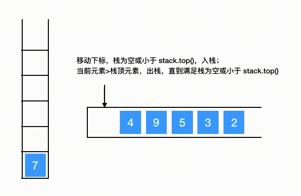

# 贰.1.2 单调栈

## **贰.1.2.1 定义**

**单调栈，顾名思义就是栈内元素单调按照递增\(递减\)顺序排列的栈**。是递增栈还是递减栈，是以出栈的顺序而区别的，出栈的顺序如果是递增，就是单调递增栈，反之则反。

示例：用数组`[7,4,9,5,3,2]`构建一个单调递减栈。



代码示例：

```javascript
(()=>{
    let A=[7,4,9,5,3,2],stk=[];
    let l=A.length;
    for (let i = 0; i < l; i++) {
        while (stk.lenght && A[i] <= A[stk[stk.length-1]]) { // 单调递增栈
            // 单调递减栈的情况为 A[i] >= A[stk[stk.length-1]]]
            stk.pop();
        }
        stk.push(i);
    }
})();
```

## 贰.1.2.2 应用场景

* 找出数组中每项左右两边第一个大于/小于它的解。
* 题目中隐含查找第一个（或离此元素最近的）大于/小于此元素的值，这类问题都可以考虑用单调栈求解。

## 贰.1.2.3 注意要点

单调栈的核心并不是单调，单调只不过是副产品。单调栈的实际意义在于：

* 对于将要放入单调栈的数字，栈里的所有数都比这个将要放入的数小。
* 那么，对于每个成功留在栈里的数字来说，前面的所有数都比这个数小，由此易得这个栈一定是单调递增的，但单调递增本身的意义并不大。
* 单调栈里最新放入的数具有这样的特点：
  * 比将要放入的数小，否则弹出这个数。
  * 是原数组中，在将要放入的数m的左/右边，且距离m最近，的比m小的数。 
* 实际栈中并不保存数本身，而是保存其在原数组中的位置。
* 若从1到N遍历一遍，把每个将要放入的数对应的栈顶元素的位置记录下来，就可以在O\(N\)的时间复杂度内得到所有元素的左/右边，距离该元素最近、比该元素小的元素的位置。

## 贰.1.2.3 应用示例

