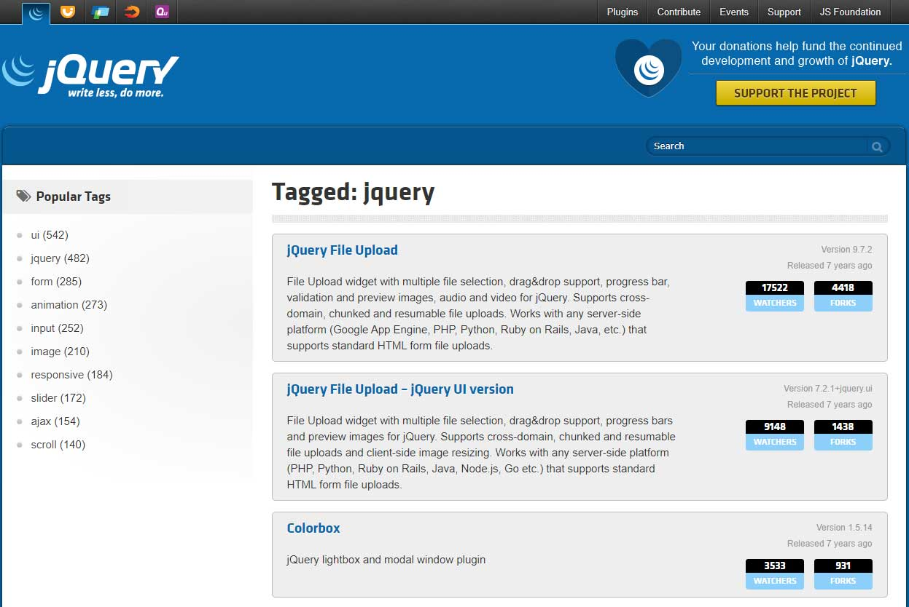

# 叁.1.1 jQuery过时了吗？

## 叁.1.1.1 jQuery带来的好处


John Resig在2006年发布了jQuery第一版，十几年过去了，截止2019年6月的统计，jQuery仍然被全球最活跃的前1000万个网站中的73%所使用，其影响力之大可见一斑。jQuery作为最流行的JavaScript库，其诞生之初便为前端开发带来了以下好处：

### **1. 解决了当时浏览器兼容问题**

jQuery诞生时的2006年，微软IE6在浏览器市场里所占份额最大。这个“傲慢”的浏览器自成一套，很多API没有遵从W3C标准，因此造成各种兼容问题（出于浏览器大战时的竞争策略的考虑，微软没有把遵从W3C标准放在重要的位置）。调用某些相同功能的DOM API，IE6与其他浏览器比如Firefox、Opera、Safari在语法上有差异。这让前端工程师经常要写两份甚至多份代码，不胜其苦。最烦恼的还不止于此，微软自己的浏览器，若版本不一样居然也有兼容性问题，比如IE6的代码居然也不兼容IE7、IE8！此时jQuery出现了，它及时、有效地解决了这些问题，让前端工程师只需要写一份代码，无须担心兼容性。这也是jQuery大受欢迎的最重要的原因。

```javascript
// 过去如果不用jQuery，监听事件（兼容IE6）要这么写
if (button.addEventListener)  
  button.addEventListener('click',fn);
else if (button.attachEvent) { 
  button.attachEvent('onclick', fn);
}else {
  button.onclick = fn;
}

// 但是如果用jQuery只需要这么写
$(button).on('click', fn)
```

### **2. 发明了一种便捷的DOM操作方式**

jQuery 极大地简化了对元素选择：

```javascript
// 如果你想获取 .nav > .navItem 对应的所有元素，用 jQuery 是这样写的
$('.nav > .navItem')

// 在 IE 6 上，你得这么写
var navItems = document.getElementsByClassName('navItem')
var result = []
for(var i = 0; i < navItems.length; i++){
  if(navItems[i].parentNode.className.match(/\bnav\b/){
    result.push(navItems[i])
  }
}
```

### **3. 可简单方便地实现动画效果**

### **4. 封装了极易使用的Ajax**

## 叁.1.1.2 现在已经有了比jQuery更好的方案

随着时代的发展，毕竟也有十几年过去了，前端开发有了很大的变化。针对jQuery的4点特性，现在已经有更好的替代方案。

### 1. 针对兼容性

现在主流浏览器拥抱W3C标准，因此浏览器之间的兼容性做得越来越好。兼容性做得极差的浏览器IE6已经成为历史，甚至在绝大多数生产环境中连IE8都可以不用考虑，况且还有Babel.js这样的轻量级的库存在。

### 2. 针对DOM操作

jQuery能够快速选取DOM节点，这个无疑是jQuery受欢迎的一个重要的原因。但是就目前情况来说，这个优势已经没有用了，为什么呢？有两个已经成为W3C标准的API：`document.querySelector`和`document.querySelectorAll`，这两个API可以通过传入css选择器形式的字符串，以匹配到预期的DOM节点，而且基于浏览器的实现其执行效率更好。

而MVVM一类的框架比如React/Vue/Angular的流行，其双向绑定的特性已经让DOM的更新变成由框架自行处理，让前端工程师可以不需要操作DOM（改为让框架自行去操作Vitual DOM），只需要专注数据和业务逻辑。而且React/Vue/Angular这些主流框架针对DOM的操作时做了大量的[Repaint和Reflow](../1/1.4.2.md)有关的优化，比如基于虚拟DOM进行计算，将多次对真实DOM的操作精简为最小变动然后操作真实DOM、在同一个Event Loop循环内将多次DOM操作事件合并……这些优化措施都能有能更好的表现，而这些优化jQuery并没有做。

### 3. 动画领域的替代方案

现在CSS3动画技术已经非常的成熟，已经完全可以取代jQuery做的动画。css3能比jQuery的animate方法实现更复杂的动画，兼容性好，性能消耗小。举个例子，比方说如果实现背景颜色过度，CSS3可以完美的实现，但是jQuery就不方便。现在已经出现了很多优秀的css3动画库，比如Animate.css。

### 4. Ajax也有了更好的替代

Fetch已经完美地取代Ajax成为实现异步任务的标准。jQuery的ajax操作，为我们省去了兼容浏览器方面的问题，并且也提供了简明的API去调用get和post，让开发者从繁琐的兼容性与使用原生API上解脱出来。但是现在，这个优势也已经非常微小了。不管是原生JavaScript的Fetch API还是第三方库axios，都为我们提供了强大的ajax使用能力，并且axios还有拦截器这个优势。这时相较而言，jQuery的ajax确实已经无法相比了。

当然，Fetch在IE浏览器里需要有Fetch的Polyfill方案：[github/fetch](https://link.zhihu.com/?target=https%3A//github.com/github/fetch)，这样只需要引用这一个小小的JS，就可以使用方便的ajax了，相较于jQuery小巧很多。

## 叁.1.1.3 jQuery留给我们的财富

### 1. 大量功能强大方便使用的插件

jQuery发展这么多年，它最大的价值之一在于社区积攒的各种插件。无论是做日期选择器还是轮播图，甚至搞个播放器，都可以分分钟找到一个对应的插件。 比如 [CSS transitions and transformations for jQuery](http://ricostacruz.com/jquery.transit/) 这个动画插件，我到现在也还在用，完全没问题。

更多宝矿可以自行浏览jQuery插件网站：[https://plugins.jquery.com/](https://plugins.jquery.com/) 这个网站虽然不再接纳新的插件，但可以作为一份地图，可以方便找到jQuery流行插件的Github主页，然后你会发现，很多插件都还非常活跃而且更新非常频繁。



### 2.简洁易懂的API设计

jQuery 的 API 风格依然在流行。我们把 jQuery 和 [Axios ](https://github.com/axios/axios)做一下对比：

```javascript
$.ajax({url:'/api', method:'get'})
$.get('/api').then(fn1,fn2)

axios({ url: '/api', method: 'get'})
axios.get('/api').then(fn1, fn2)
```

为什么 2018 年开始流行的 axios 跟 jQuery.ajax 这么相像呢？因为 jQuery 的 API 实在太好用了！搞得新库根本没法超越它，没有办法设计出更简洁的 API 了。

### 3.一些鬼斧神工似的编程技巧

在[壹.2.1 函数](../1/1.2.1.md) 里面最末尾有John Resig的一段有关“用原生JavaScript实现多态”的代码，已经见识到jQuery之父的coding能力。

## 结语

如果你读到这里，想必也不会在意jQuery是否过时了。

其实，jQuery虽然完成了它的历史使命，并且在逐渐被新的库/框架所替代，但它给我们留下了很多宝贵的财富，仍然值得我们去阅读/学习它的源码和思想。学了jQuery 对写代码和封装库很有帮助，现在的前端工程师新人依然可以学习 jQuery 的思想，因为新人直接理解 Vue / React 的底层思想难度较大，而jQuery 是一个很不错的中间过渡。

同时，jQuery 也蕴含了非常多的编程套路。如果你不想学jQuery，直接去学 React/Vue /Angular 会难一点，当然硬要学也能学会，但也仅此而已，反正回头还是要研究更深层次的JavaScript套路，这些在jQuery里都有。

## 参考文献


[https://en.wikipedia.org/wiki/JQuery](https://en.wikipedia.org/wiki/JQuery)  
[https://zh.wikipedia.org/wiki/%E6%B5%8F%E8%A7%88%E5%99%A8%E5%A4%A7%E6%88%98](https://zh.wikipedia.org/wiki/%E6%B5%8F%E8%A7%88%E5%99%A8%E5%A4%A7%E6%88%98)


