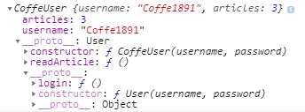

# 陆.2.3 重新认识JavaScript面向对象: 继承

抛开JavaScript自带的class语法糖实现类的继承，如果用原生JavaScript实现类的继承，有以下六种方式，其实现代码与优缺点分析如下：

## 01.类式继承\(classical inheritance\)

 实现本质：重写子类的原型，代之以父类的实例。

```javascript
//父类
function User(username) {
   this.username = username ? username : "Unknown";
   this.books = ["coffe", "1891"];
}
//子类
function CoffeUser(username) {
   if (username)
      this.username = username;
}

//关键
CoffeUser.prototype = new User();

const user1 = new CoffeUser();
const user2 = new CoffeUser();

//instanceof是检测某个对象是否是某个类的实例
console.log(user1 instanceof User);//>> true

// 可以直接访问原型链上的属性
console.log(user1.username);//>> Unknown
console.log(user1.books); //>> ["coffe", "1891"]

//修改来自原型上的引用类型的属性，则有副作用：会影响到所有实例
user1.books.push("hello");
console.log(user1.books); //>> ["coffe", "1891", "hello"]
console.log(user2.books); //>> ["coffe", "1891", "hello"]

//修改来自原型上的值类型的属性，无副作用
user1.username = 'U';
console.log(user1.username, user2.username); //>> U Unknown
```

缺陷：

* **引用类型属性的误修改。**原型属性中的引用类型属性会被所有实例共享，若子类实例更改从父类原型继承来的引用类型的共有属性，会影响其他子类。
* **无法传递参数。**在创建子类型的实例时，不能向父类的构造函数中传递参数。这点如过不好理解的话，接着看下面的“构造函数式继承”。

综上，我们在实际开发中很少单独使用类式继承。

## 02.构造函数式继承

实现本质：在类的构造函数里通过调用call/apply来实现继承。

```javascript
function User(username, password) {
   this.password = password;
   this.username = username;
   User.prototype.login = function () {
      console.log(this.username + '要登录Github，密码是' + this.password);
   }
}

function CoffeUser(username, password) {
   User.call(this, username, password);//通过call向父类的构造函数传递参数
   this.articles = 3; // 文章数量
}

const user1 = new CoffeUser('coffe1891', '123456');

console.log(user1 instanceof User);//>> false
console.log(user1.username, user1.password); //>> coffe1891 123456
console.log(user1.login()); // TypeError: user1.login is not a function
```

存在明显的缺陷：

* 无法通过instanceof的测试；
* 并没有继承父类原型上的方法。

## 03.组合式继承

既然上述两种方法各有缺点，但是又各有所长，那么我们是否可以将其结合起来使用呢？即原型链继承方法，而在构造函数继承属性，这种继承方式就叫做“组合式继承”。

```javascript
function User(username, password) {
   this.password = password;
   this.username = username;
   User.prototype.login = function () {
      console.log(this.username + '要登录Github，密码是' + this.password);
   }
}

function CoffeUser(username, password) {
   User.call(this, username, password); // 第2次执行 User 的构造函数
   this.articles = 3; // 文章数量
}

CoffeUser.prototype = new User(); // 第1次执行 User 的构造函数
const user1 = new CoffeUser("coffe1891", "123456");

console.log(user1 instanceof User);//>> true
user1.login();//>> coffe1891要登录Github，密码是123456
```

虽然这种方式弥补了上述两种方式的一些缺陷，但有些问题仍然存在：

* 父类的构造函数被调用了两次，显得多余；
* **污染：**若再添加一个子类型，给其原型单独添加一个方法，那么其他子类型也同时拥有了这个方法。

综上，组合式继承也不是我们最终想要的。

## 04.原型继承\(prototypal inheritance\)

原型继承实际上是对类式继承的一种封装，只不过其独特之处在于，定义了一个干净的中间类，如下：

```javascript
function createObject(o) {
    // 创建临时类
    function F() {
        
    }
    // 修改类的原型为o, 于是f的实例都将继承o上的方法
    F.prototype = o;
    return new F();
}
```

这不就是ES5的 `Object.create` 吗？没错，你可以认为是如此。

既然只是类式继承的一种封装，其使用方式自然如下：

```text
CoffeUser.prototype = createObject(User)
```

也就仍然没有解决类式继承的一些问题。从这个角度而言，原型继承和类式继承应该直接归为一种继承。

## 05.寄生式继承

寄生式继承是与原型继承紧密相关的一种思路，它依托于一个内部对象而生成一个新对象，因此称之为寄生。

```javascript
const UserSample = {
   username: "coffe1891",
   password: "123456"
}

function CoffeUser(obj) {
   var o = Object.create(obj);//o继承obj的原型
   o.__proto__.readArticle = function () {//扩展方法
      console.log('Read article');
   }
   return o;
}

var user = new CoffeUser(UserSample);
user.readArticle();//>> Read article
console.log(user.username, user.password);//>> coffe1891 123456
```

## 06.寄生组合式继承

```javascript
//寄生组合式继承的核心方法
function inherit(child, parent) {
   // 继承父类的原型
   const p = Object.create(parent.prototype);
   // 重写子类的原型
   child.prototype = p;
   // 重写被污染的子类的constructor
   p.constructor = child;
}

//User, 父类
function User(username, password) {
   let _password = password
   this.username = username
}

User.prototype.login = function () {
   console.log(this.username + '要登录Github，密码是' + _password);
   //>> ReferenceError: _password is not defined
}

//CoffeUser, 子类
function CoffeUser(username, password) {
   User.call(this, username, password) // 继承属性
   this.articles = 3 // 文章数量
}

//继承
inherit(CoffeUser, User);

//在原型上添加新方法
CoffeUser.prototype.readArticle = function () {
   console.log('Read article');
}

const user1 = new CoffeUser("Coffe1891", "123456");
console.log(user1);
```

观察chrome浏览器的输出结果：



简单说明一下：

* 子类继承了父类的属性和方法，同时，属性没有被创建在原型链上，因此多个子类不会共享同一个属性；
* 子类可以传递动态参数给父类；
* 父类的构造函数只执行了一次。

Nice！这才是我们想要的继承方法。然而，仍然存在一个美中不足的问题：

* 子类想要在原型上添加方法，必须在继承之后添加，否则将覆盖掉原有原型上的方法。这样的话若是已经存在的两个类，就不好办了。

所以，我们可以将其优化一下：

```javascript
function inherit(child, parent) {
    // 继承父类的原型
    const parentPrototype = Object.create(parent.prototype)
    // 将父类原型和子类原型合并，并赋值给子类的原型
    child.prototype = Object.assign(parentPrototype, child.prototype)
    // 重写被污染的子类的constructor
    p.constructor = child
}
```

但实际上，使用`Object.assign` 来进行 copy 仍然不是最好的方法。因为根据本书[ 深拷贝与浅拷贝](../1/1.3.1.md#2object-de-nei-zhi-fang-fa-assign)的描述，上述的继承方法只适用于 copy 原型链上可枚举的方法，而ES6中，类的方法默认都是不可枚举的。此外，如果子类本身已经继承自某个类，以上的继承将不能满足要求。

## 参考文献


[Inheritance in JavaScript](https://developer.mozilla.org/en-US/docs/Learn/JavaScript/Objects/Inheritance)


